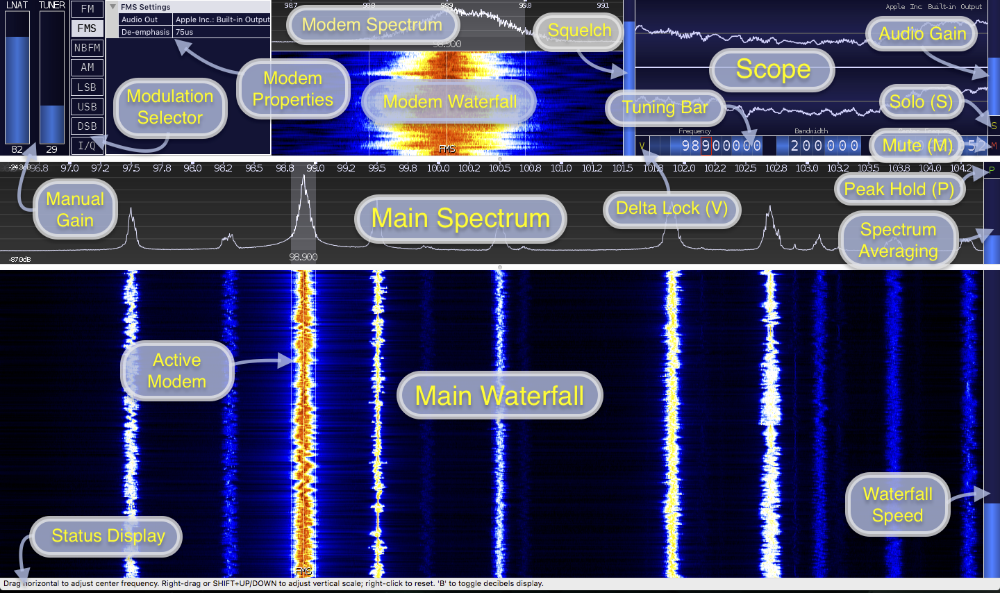

==================================
CubicSDR - Main Application Window
==================================

.. tcctree::
   :maxdepth: 3

---------------------
Basic Feature Outline
---------------------

Main Spectrum and Waterfall
===========================

Description
-----------
The main spectrum and waterfall display the active radio input.  The display can be zoomed and navigated using the arrow keys or mouse and mouse wheel.  

Zooming
-------
Zooming is achieved by using the up and down arrow keys or the mouse wheel.  Hovering on the spectrum or waterfall will target a particular frequency during zoom.

While zooming, aliases from neighbouring signals can sometimes be observed as CubicSDR uses a fixed resolution FFT and a combination of scaling and decimation for zooming; adjusting the zoom distance or center frequency can alleviate these aliases if necessary and efforts will be made to elimante them in future releases.

Visual Gain
-----------
Visual Gain can be adjusted by right clicking and dragging on the Main Spectrum; Visual Gain also affects the relative contrast in the Main Waterfall.

Right-clicking once on the Main Spectrum will reset the current Visual Gain (and clear Peak Hold history)

Pressing SHIFT and the UP / DOWN arrow keys will also fine-tune the Visual Gain.

Tuning
------
Basic center frequency tuning is achieved by dragging left or right on the main spectrum.  The left and right arrow keys can also be used for tuning; holding the shift key will accelerate the tuning keys.

You can also use the Tuning Bar to set the center frequency directly.

Adding a Modem
--------------
If there's currently no modem in range, hovering and clicking on the waterfall will add a new one.  To add additional modems hold the shift key while placing; the color will change to green to indicate a new modem will be created (as opposed to moving an existing one which will appear in red).

There is currently no limit on the number of modems that can be added other than the available CPU and Memory resources.  

Note that modems that move out of center frequency range will deactivate and re-activate later when you return to their range.

Interacting with a Modem on the Main Waterfall
----------------------------------------------
Clicking a modem will make it the active modem.  The active modem will appear highlighted, it will also appear red when hovering elsewhere to indicate that it's the modem that will be affected by the next action.  

Hovering a modem and dragging from it's center will change it's frequency.  Dragging the edge of a modem will change it's bandwidth.  You can also use the Tuning Bar to adjust the active modem's frequency and bandwidth.

When selected the active modem will be reflected in the Modem Spectrum, Modem Waterfall, Squelch, Audio Gain, Mute, Tuner Bar Frequency and anywhere else that is related to the active modem.

The active modem also related to the "Audio Output" selection in the menu; you can use this to assign individual modems to any desired audio output.  The active audio output will be displayed in the upper right corner of the Scope. 

Pressing '[' or ']' keys will nudge the current modem by the active snap value (snap value is set/cleared by right clicking on a Tuner Bar frequency digit)

There are additional keys available when hovering the mouse over a modem, even if it's not the active modem:

* Pressing 'D' will delete the modem
* Pressing 'M' will mute the modem
* Pressing 'E' will edit the modem's label (also saved to sessions)

Modem Spectrum and Waterfall
============================

The modem spectrum and waterfall can be used just like the main waterfall with the exception of zooming and panning features.  

These views show the spectrum and waterfall from the signal feed to the active modem; this is a channelized feed from the main input and can sometimes show neighbouring artifacts from nearby channels.

Modem Properties
================

The modem properties are used to configure things relevant to the active modem.  

All modems have the following basic properties, other options may be available depending on the modem type:

* "Audio Out" can be configured per-modem; each modem can be routed to any available audio output. 

Tuning Bar
==========

The tuning bar provides a simple way to control the active modem frequency, bandwidth and the center frequency.

Right-clicking a modem frequency digit will enable Frequency Snap.  The snapped digit will be bordered in red; any drags, clicks or new modem frequencies will not tune digits below the snapped one.  Additionally nudging the active modem with '[' and ']' will follow the snap value.  To disable snapping, right-click the digit again or right-click the 1hz increment digit.  

Any of the values on the tuning bar can be adjusted in single steps by clicking the upper or lower portion of a digit.  Additionally you can use the mouse wheel while hovered over a digit or drag it left or right to change value.  

Holding the SHIFT key while changing a tuning bar digit will prevent any carry-over and allow you to adjust from 9->0 or 0->9 without carrying to neighbouring digits.

Modulation Selector
===================

The modulation selector allows you to change modulation type for the active modem.  

There are currently several analog modulation types available:

* AM: Amplitude
    * AM with carrier signal, Default 6KHz, Min 500Hz, Max 500KHz
* FM: Frequency
    * Default 200KHz bandwidth, Min 500Hz, Max 500KHz, Mono
* FMS: Stereo Frequency
    * Default 200KHz, Min 100KHz, Max 500KHz, Stereo (multiplex)
    * Properties:
        * De-emphasis: set the de-emphasis to balance the bass and treble to intended ranges (default 75us)
* NBFM: Narrow-Band Frequency
    * Default 12.5KHz, Min 500Hz, Max 500KHz, Mono
* LSB: Lower-Side Band
    * Lower-Side Band of AM (no carrier), Default 2.7KHz, Min 250Hz, Max 250KHz
* USB: Upper-Side Band 
    * Upper-Side Band of AM (no carrier), Default 2.7KHz, Min 250Hz, Max 250KHz
* DSB: Dual-Side Band
    * Same as AM but without carrier signal, Default 5.4KHz, Min 500Hz, Max 500KHz
* I/Q: Raw I/Q Pass-Thru (No Modulation)
    * Raw I/Q samples that would normally go to a modem are passed through to the sound card for use elsewhere.  Bandwidth is fixed to the selected sound card output frequency and will change along with it.  Note that turning the Audio Gain down to a low level will disable gain completely and output the raw decimated samples. 

Digital modes are a work-in-progress but will be available in future versions.

There are additional keys available for controlling the active modem's modulation selection:

* 'A' will select AM.
* 'F' will cycle between FM, FMS and NBFM.
* 'L' will select LSB.
* 'U' will select USB.

Squelch
=======

The Squelch meter display the active signal level; to set squelch click or drag the meter to the desired trigger point.  Right-clicking the squelch meter will set it just above the current signal level.

Visible squelch floor and ceiling will be adjusted dynamically in an attempt to keep the relevant signal area in view.  The set squelch level may also move with the signal when it changes but it remains at the same value.

Audio Gain
==========

By default CubicSDR will attempt to normalize the output from all active modems; if you want to adjust the gain of one modem versus another or enhance the automatic gain performance of an amplitude modulated signal you can use the audio gain to adjust the level.

When using I/Q modulation dragging the gain to a low level will de-activate any automatic gain applied and output the original decimated signal input.

Peak Hold
==========

Activating Peak Hold will keep a maximum level history for the main and modem spectrum. 

Adjusting frequency or right-clicking the spectrum will reset the current Peak Hold history (and Visual Gain).

Pressing 'P' will also toggle the Peak Hold button.

Spectrum Averaging
==================

Spectrum averaging speed can be adjusted by clicking / dragging the meter to the right of the main spectrum.  Mouse wheel can also be used. 

Waterfall Speed
===============

Waterfall speed can be adjusted from 1 to 1024 lines per second by clicking / dragging the meter to the right of the main waterfall.  Mouse wheel can also be used.

Waterfall history will continue to be collected and rendered at the desired rate while minimized; reducing speed before minimizing will reduce CPU load for this task.

Manual Gain
===========

If Automatic Gain is deactivated the Manual Gain sliders will appear.  Available gain levels can be adjusted by clicking/dragging or using the mouse wheel on the desired meter.

Status Display
==============

While hovering the Status Display will display relevant tips to the currently hovered UI element or action.  Hover Tips are also enabled by default but can be disabled in the Settings menu.

Solo
====

Enabling the Solo feature will mute all except the active modem.  Selecting another modem will change the Solo focus. 

Solo mode is useful when you have many modems and want to focus on a particular one.  Focus to the next and previous modem can be achieved with TAB and SHIFT-TAB on the keyboard.

If modems are squelched while in Solo Mode the modem that breaks squelch will be focused and held for the duration of the squelch break.

Pressing the 'S' key will also toggle Solo Mode for the active modem.

Mute
====

The Mute button shows the current mute state of the active modem and can be used to toggle it.  The 'M' key can also be used to toggle mute for the active modem.

Delta Lock
==========

The Delta Lock button shows the current delta lock state of the active modem and is used to toggle it.   

When a modem is delta-locked it will remain at a fixed frequency relative to the center frequency.   This allows you to tune freely without changing the relative modem position.

The delta lock feature is useful in conjunction with sessions for creating band-plan relative set-ups.  Changing bands via the center frequency won't alter the active modem setup.

Pressing the 'V' key will also toggle Delta Lock Mode for the active modem.

Direct Input
============

Most numeric controls (speeds, levels, frequencies) in the CubicSDR application window can be entered directly on the keyboard.  Hover over the desired value and press SPACE to open the input dialog; or just start typing a number and the dialog will appear automatically.

Pressing SPACE or typing a digit when not hovered over anything will open the Direct Input dialog for the Center Frequency.

For frequencies, Direct Input will also accept suffixes 'Hz', 'Mhz', 'KHz' and 'GHz' and will attempt to use the best suffix when presenting the existing frequency.  If no suffix is used it will be assumed to be in MHz unless the value is greater than 3000, which will then default to Hz. 

